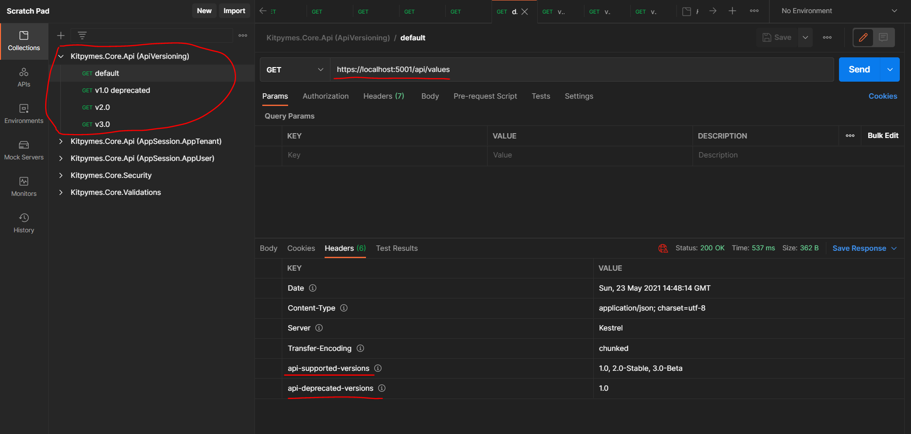

## Test

### El objetivo es mantener un versionado de las api, para ser reutilizado de una forma fácil y rápida.

* Seleccionar el proyecto "Tests.Api.Versioning".

* Configurar en la clase "Startup" el ApiVersioning:

```cs
public void ConfigureServices(IServiceCollection services)
{
	services.LoadApiVersioning(options => {});
}

public void Configure(IApplicationBuilder app, IWebHostEnvironment env)
{
	app.LoadApiVersioning();
}
```

* Iniciar la api con el perfil "Test".

* Iniciar Postman y usar la colección "Kitpymes.Core.Api (ApiVersioning)".

