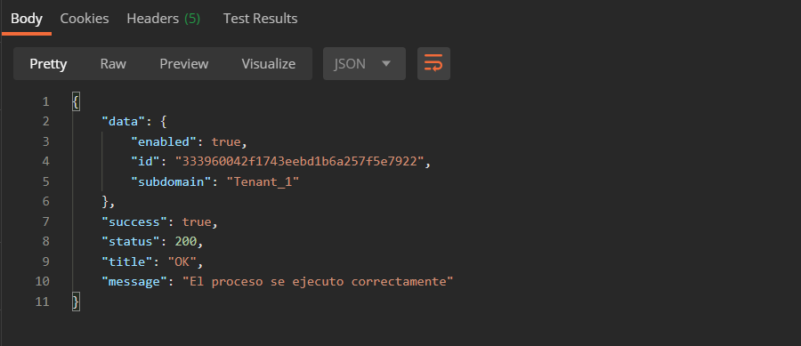
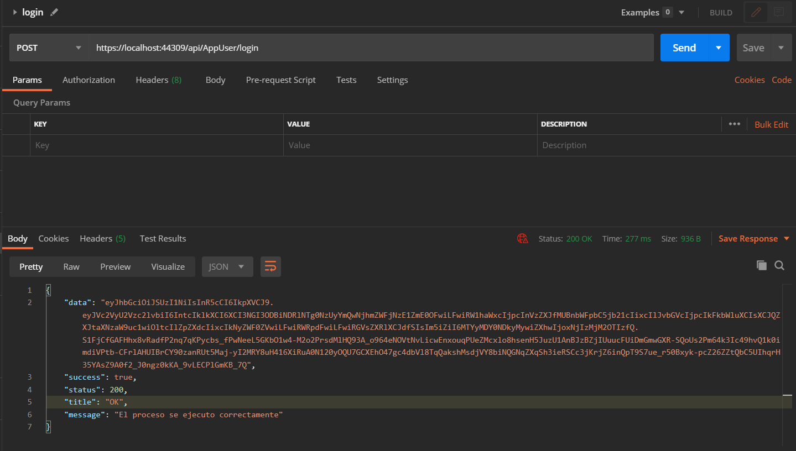
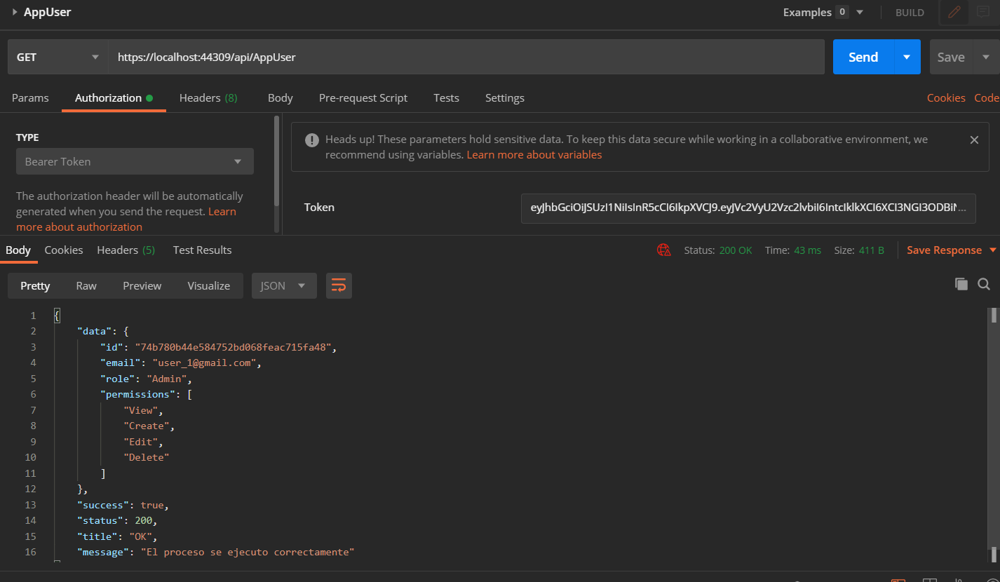

## Test AppTenant

### El objetivo es guardar en sesión el nombre del inquilino (tenant o subdominio) para consultar sus datos desde cualquier parte de la app.

* Buscar el archivo "applicationhost.config" en la carpeta "template-netcore-api\.vs\Solution\config\".

* Buscar la palabra "localhost" en el archivo "applicationhost.config".

* Agregar los tenants que sean necesarios:

```xml
<binding protocol="https" bindingInformation="*:44357:[TENANT].localhost" />
<binding protocol="https" bindingInformation="*:44357:[TENANT].localhost" />
```

* Agregar en el Startup el "LoadAppTenant" y comentar "LoadAppUser".

* Iniciar la api con el perfil "IISExpress".

* Iniciar Postman collections "Kitpymes.Core.Api (AppSession.AppTenant)".




## Test AppUser

### El objetivo es guardar en sesión los datos mas relevantes del usuario logueado para consultar sus datos desde cualquier parte de la app.

* Agregar en el Startup el "LoadAppUser" y comentar "LoadAppTenant".

* Iniciar la api con el perfil "IISExpress".

* Iniciar Postman collections "Kitpymes.Core.Api (AppSession.AppUser)".

* Obtener el token ejecutando la api "login".



* Copiar el token en la pestaña Authorization -> Bearer Token.

* Ejecutar la api "AppUser".

