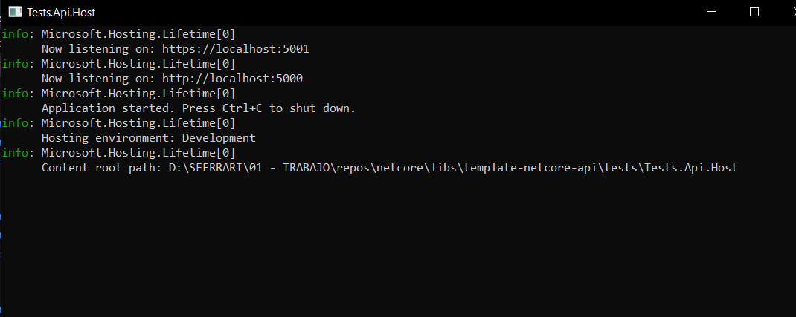
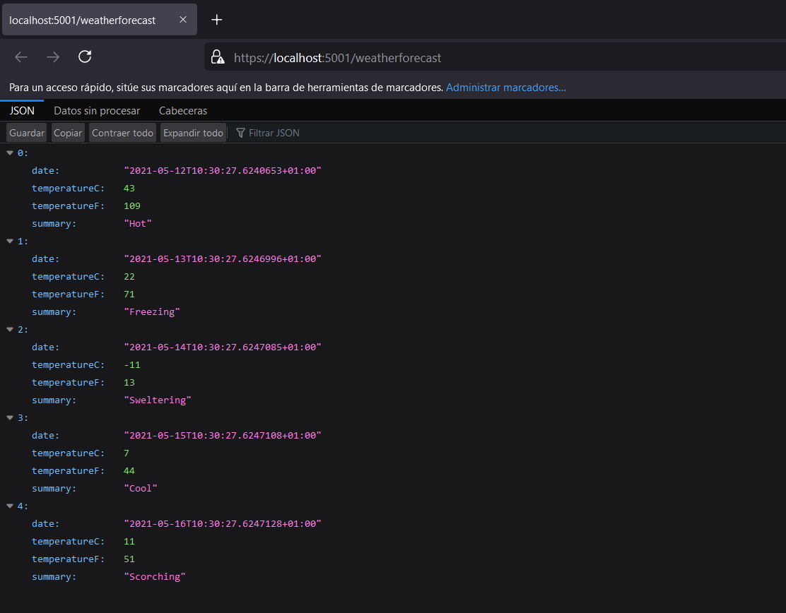

## Test

### El objetivo es crear un host de aplicación por defecto, para ser reutilizado de una forma fácil y rápida.

* Agregar en la clase "Program": 

* Iniciar la api con el perfil "Tests.Api.Host":

_Resultado Consola_

_Resultado Web_

