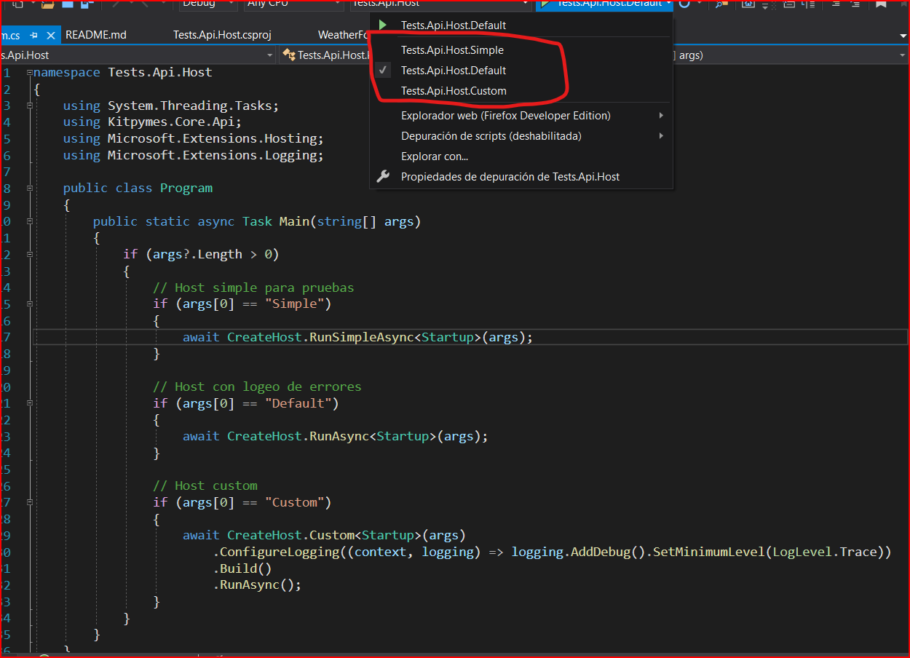
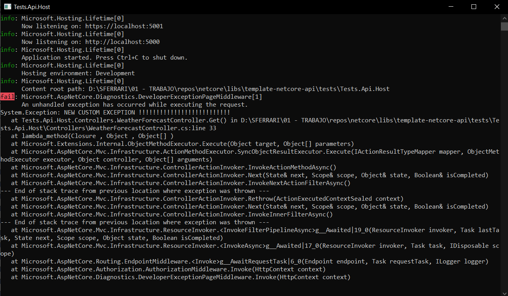
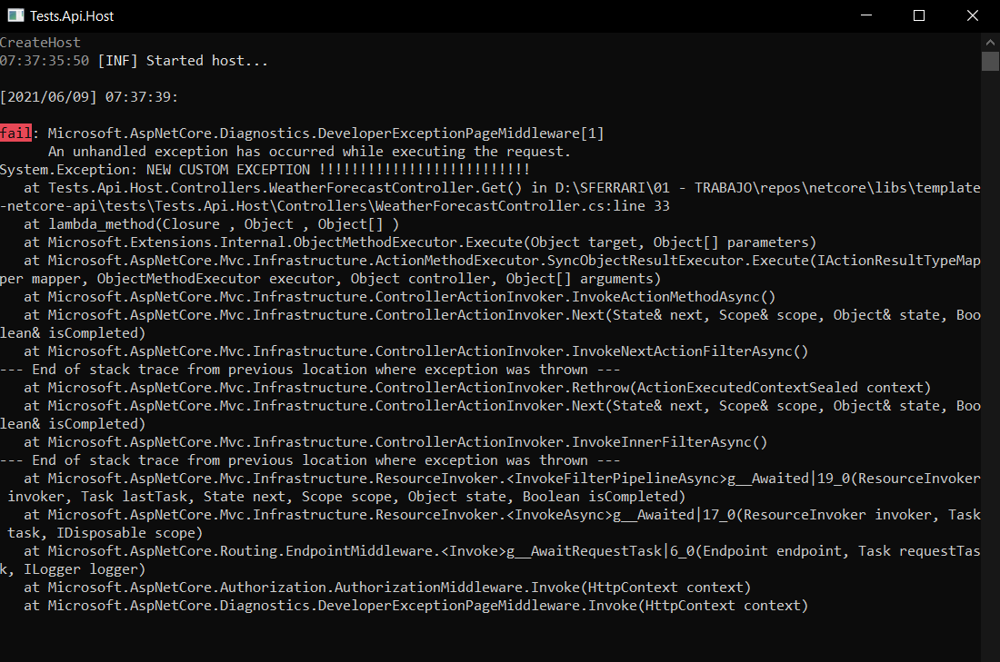
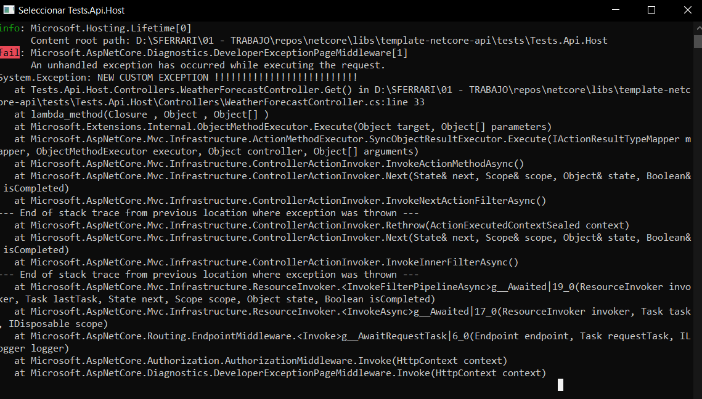

## Test

### El objetivo es crear un host de aplicación por defecto, para ser reutilizado de una forma fácil y rápida.

* Se puede ejecutar 3 tipos de host: 

* Iniciar la api con el perfil "Tests.Api.Host.Simple":

_Host simple utilizado mayormente para pruebas_

* Iniciar la api con el perfil "Tests.Api.Host.Error":

_Host con logeo de errores, si ocurre un error en el inicio del host lo muestra en consola y lo guarda en un registro "Logs/start_host/{Date}.log", si ocurre un error en la ejecucción de la app lo muestra en consola y/o en archivo y/o en una base de datos según la configuración de la librería "Kitpymes.Core.Logger", este host es el mas utilizado para producción_

* Iniciar la api con el perfil "Tests.Api.Host.Custom":

_Host Custom para ser configurado según necesidades_

