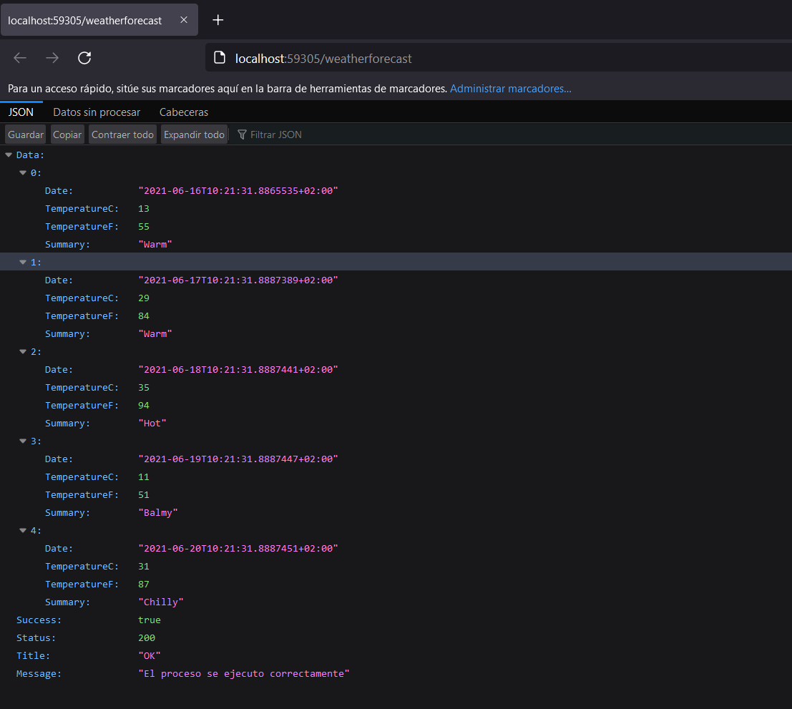

## Test

### El objetivo es devolver resultados de las apis creando un ActionResult personalizado, para ser reutilizado de una forma fácil y rápida.

* Iniciar la api con el perfil "IIS Express":

_Response utilizando Result_

