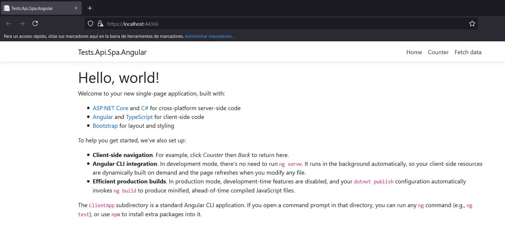

## Test

### El objetivo es crear una SPA de Angular, para ser reutilizado de una forma fácil y rápida.

* Seleccionar el proyecto "Tests.Api.Spa.Angular".

* Configurar en la clase "Startup":

```cs
public void ConfigureServices(IServiceCollection services)
{
	services.LoadSpa();
}

public void Configure(IApplicationBuilder app, IWebHostEnvironment env)
{
	app.LoadSpa(options => options.WithEnabled()
		.WithAngular(angular => angular.WithEnabled().WithSourcePath().WithBaseUri().WithNpmScript()));
}
```

* Iniciar la web de Angular con el perfil "Test".

