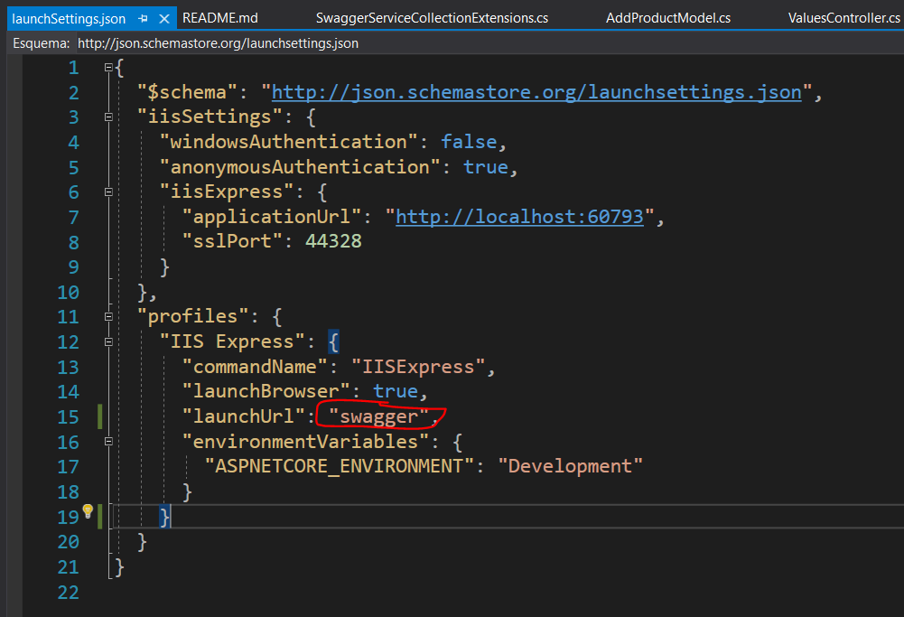
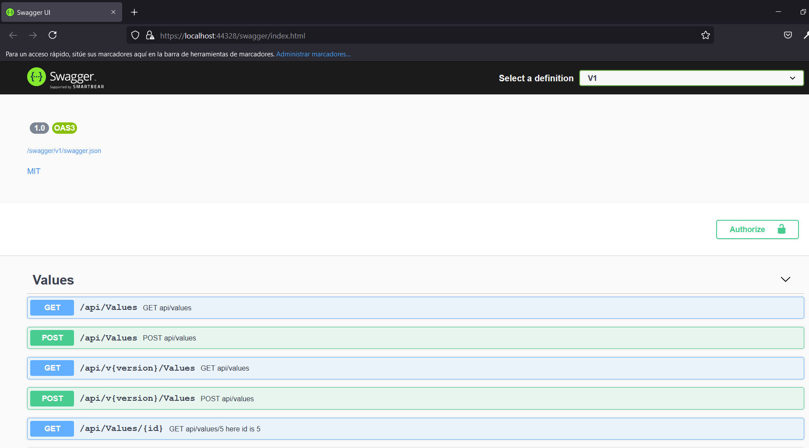

## Test

### El objetivo es crear una web para invocar los endpoints de la api con swagger, para ser reutilizado de una forma fácil y rápida.

* Agregar en el archivo "launchSettings.json": 

* Iniciar la api con el perfil "IIS Express":

_Resultado Web_

